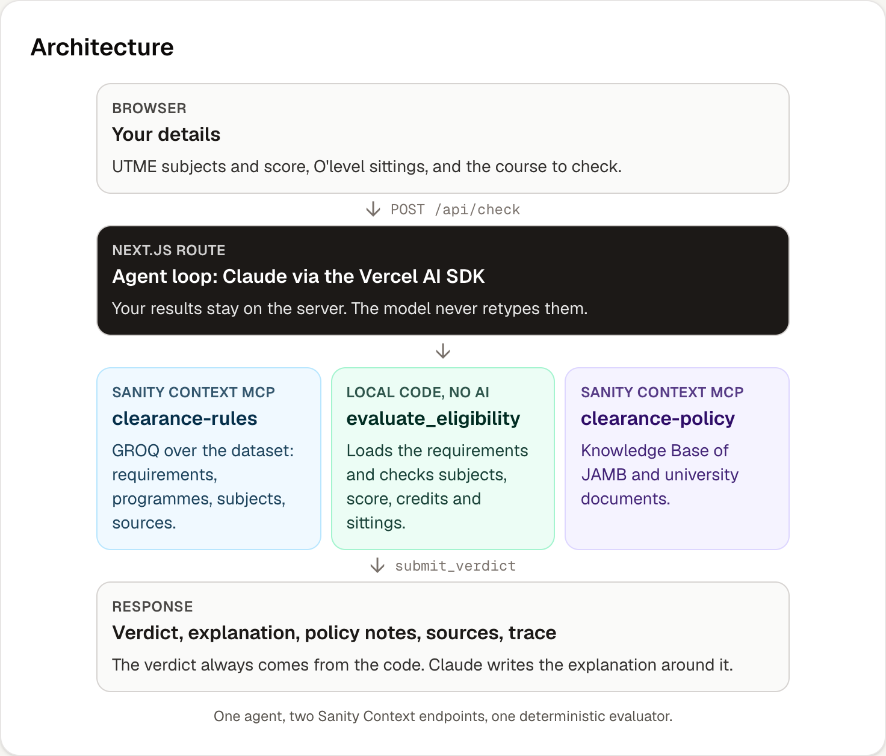

# Clearance Desk

An AI agent that tells Nigerian university applicants whether their **UTME subjects, UTME score and O'level results** meet the published requirements for a specific course at a specific university — *before* they apply, so they don't get admitted and then rejected at clearance.

Built for the DEV × Sanity Challenge, Path One: "Ship an Agent That Queries Real Content".

**Live:** https://clearancedesk.vercel.app (no login). The About page shows the architecture and live data coverage.



**Core principle: the model finds and explains; deterministic code judges.**

> 🚧 Work in progress. See [`BUILD_SPEC.md`](BUILD_SPEC.md) for the plan and [`BUILD_LOG.md`](BUILD_LOG.md) for the build journal.

## Layout

| Path | What |
|---|---|
| `studio/` | Sanity Studio + schema (sources, subjects, institutions, programmes, requirements) |
| `data/` | `sources.yaml`, `catalog.yaml`, generated `seed.ndjson` |
| `scripts/` | NDJSON builder, MCP endpoint checks, eval runner |
| `web/` | Next.js app: form, `/api/check` agent route, deterministic eligibility evaluator |

## Data (Phase 2)

34 admission requirements for the **2026/2027** session across 5 universities: UNILAG, UI, OAU, UNN and LASU. The courses are Medicine, Nursing, Computer Science, Electrical/Electronic Engineering, Economics, Accounting, Law and Mass Communication, where the sources allow.

- Every rule traces to a saved official source. These are JAMB's brochure (the IBASS API plus its PDFs) and each university's own 2026 notices and requirement documents. They are listed in [`data/sources.yaml`](data/sources.yaml).
- 13 requirements are `verified`, meaning every field was checked against its sources by an independent pass. 21 are `conflicting`, meaning official sources disagree. For those, the stricter rule is encoded and `conflictNote` names both sources.
- Public dataset (no token needed): [`*[_type=="requirement"]{_id,session}`](https://cynv9mfk.api.sanity.io/v2026-09-01/data/query/production?query=*%5B_type%3D%3D%22requirement%22%5D%7B_id%2Csession%7D). Project ID `cynv9mfk`, dataset `production`.

Rebuild the dataset from source:

```bash
npm install
npm run fetch:jamb     # JAMB brochure → data/raw/jamb-ibass/ (data/raw is gitignored)
npm run build:seed     # data/catalog.yaml + data/sources.yaml → data/seed.ndjson (validates refs, grades, UTME = 4, citations)
cd studio && npx sanity dataset import ../data/seed.ndjson production --replace
```

## Agent (Phase 5)

`POST /api/check` runs one agent loop (Vercel AI SDK 6 + Claude Sonnet 5.5) over **two Sanity Context MCP endpoints**:

| Endpoint | Source | Tools the agent gets |
|---|---|---|
| `clearance-rules` | dataset `cynv9mfk.production` | `rules_groq_query`, `rules_schema_explorer` |
| `clearance-policy` | Knowledge Base (32 JAMB/university sources) | `policy_knowledge_base_read`, `policy_knowledge_base_search` |

Both endpoints' `initial_context` is fetched over HTTP and inlined in the system prompt, so the agent starts out knowing the schema and the KB outline. Two local tools are added:
- `evaluate_eligibility` loads the requirement documents and runs the deterministic evaluator (`web/lib/eligibility`) on the server-held candidate. **The verdict always comes from here.**
- `submit_verdict` has no `execute`, so calling it ends the loop. The model's headline, explanation and policy notes are merged with the evaluator's results.

The route then applies two guards:
- A policy note is kept only if its KB path was actually read in that run.
- In check mode, only the requested programme can be evaluated.

The response also carries a trace: the tool calls in order, with the GROQ text and the KB paths.

Run it locally:

```bash
cd web && cp .env.example .env.local   # fill SANITY_ORGANIZATION_TOKEN (org token, Context Viewer) and ANTHROPIC_API_KEY
npm install && npm test && npm run dev
curl -s localhost:3000/api/check -H 'Content-Type: application/json' -d '{
  "mode": "check",
  "target": {"programmeId": "programme-unilag-medicine-and-surgery"},
  "candidate": {
    "utme": {"score": 287, "subjects": ["subject-english", "subject-biology", "subject-chemistry", "subject-physics"]},
    "olevel": {"sittings": [{"exam": "WAEC", "year": 2025, "results": [
      {"subjectId": "subject-english", "grade": "B3"}, {"subjectId": "subject-mathematics", "grade": "B2"},
      {"subjectId": "subject-biology", "grade": "B3"}, {"subjectId": "subject-chemistry", "grade": "C4"},
      {"subjectId": "subject-physics", "grade": "C5"}]}]}
  }
}'
```

The request has three parts:
- `mode`: `check` (one course) or `explore` (courses the candidate may qualify for).
- `target`: `{programmeId?, programmeName?, institutionIds?}`. A `programmeName` that isn't in the data returns `noDataReason` instead of a guess.

## Web app (Phase 6)

- **`/`** has three one-tap sample candidates and a mobile-first form. Each sample is fictional but checked against a real **verified** requirement: Eligible, At risk (awaiting a NECO result) and "would be rejected at clearance" (two sittings for a one-sitting course). `web/lib/samples.test.ts` proves each verdict against `data/seed.ndjson`.
- Each result card shows:
  - the verdict chip, course, university and session
  - every check, with its reason
  - the conditions you must check yourself
  - Knowledge Base policy notes, with links to the original sources and official/secondary badges
  - the data status, plus the requirement's sources
- "How I got this answer" lists every tool call, with the GROQ text and the KB paths.
- **`/about`** covers the architecture, why there are two Context endpoints, live data coverage from GROQ, limitations and links.
- Accessibility:
  - every input is labelled
  - native controls, so everything works from the keyboard
  - 44px touch targets
  - no horizontal scroll at 360px, checked for every result type with all panels open

## Eval (Phase 8)

15 cases. The expected verdicts were set from the original sources by an independent agent that couldn't see our data or code; the evidence is in [`eval/cases.json`](eval/cases.json).

| | Clearance Desk | Same model, no tools |
|---|---|---|
| Correct | **13 / 15** | 7 / 15 |
| Told a failing candidate "Eligible" | **0** | 3 |
| Verdicts that changed between two identical runs | 1 (a fixed bug) | 5 |

The two misses are deliberate behaviour: conflicting sources always make the verdict "At risk", and a course outside the data gets "no data". Run 1 scored 12/15. It exposed a real data bug, an unsourced exam list for LASU, which is now fixed. Full table: [`eval/results.md`](eval/results.md). Re-run with `npm run eval`.

